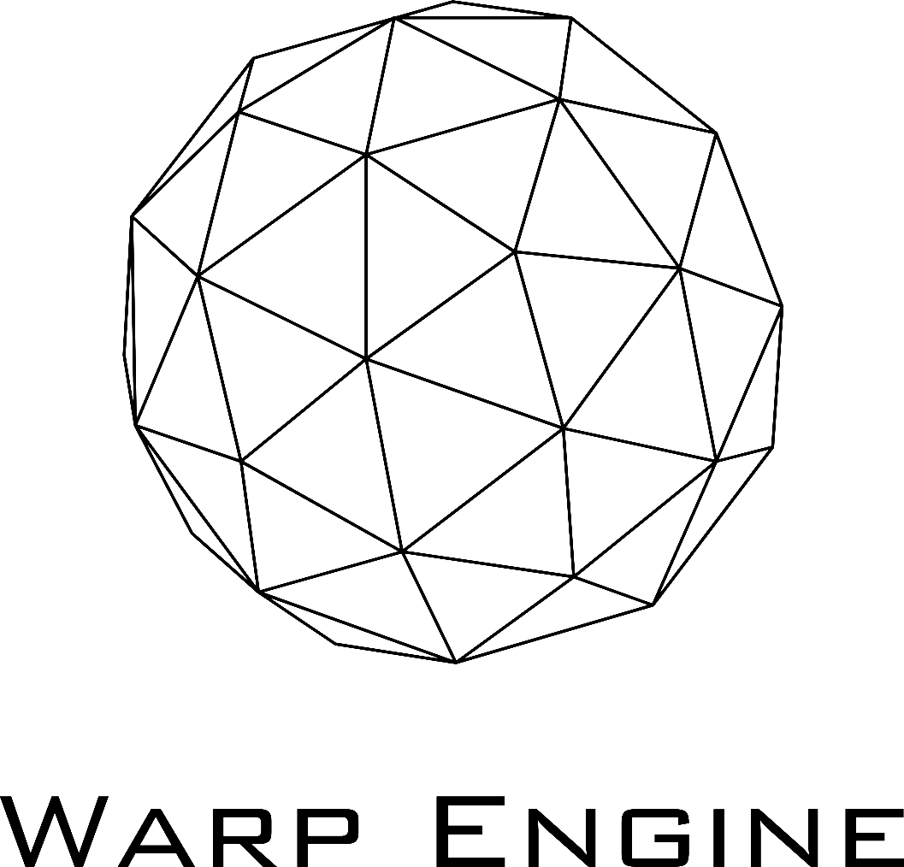

<p align="center">
<picture>
  <source width="50%" height="50%" media="(prefers-color-scheme: dark)" srcset="./docs/WarpEngineDarkMode.png">
  
</picture>
  </p>
  <hr>
<p align="center" padding-top="-50px">This is an project for last year professional project on my high school that i started on the second year</p>

## ```Checklist:```
- [ ] Minimal 3D Support
- [ ] Custom Shaders
- [ ] Minimal Lua,C# scripting inclusion
- [ ] Model Loading
- [ ] Physics
- [ ] GUI Support
- [ ] Lighting
- [ ] PBR
- [ ] Port to MacOS and Windows
